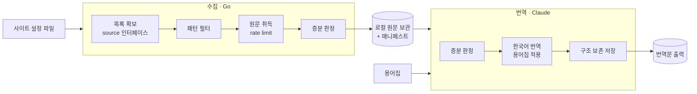

# doc-localization — ANALYSIS

## 근거
- 읽은 spec.md 범위: §1 범위, §2 목표, §3 제약, §4 제외 범위, §5 완료 조건 1–8 전체.
- 코드베이스 확인 사실: 기존 코드 없음, 신규 구성. 프로젝트는 그린필드로 `docs/` 외에 Go 소스·
  go.mod·설정 파일(yaml/toml/json)·커맨드 본체가 존재하지 않음을 탐색으로 확인했다. 따라서
  §4 영향 범위는 신규 생성 중심이며 기존에 깨질 호출자·저장 데이터·계약은 없다.
- 확정 사실(spec): 수집은 Go가 담당하는 결정적 작업이고(SPEC §3), 번역은 Claude가 파일을
  읽어 수행하며 외부 번역 API를 호출하지 않는다(SPEC §3). 이번 범위에서 실제 동작하는 source
  타입은 `llms.txt`뿐이고 `sitemap`/`crawl`은 인터페이스 정의만 둔다(SPEC §1, SPEC §4, SPEC §5.7).
- 사용자 확정 사항(이 ANALYSIS 기록 전 질문으로 해소): 번역문 단독·한국어 단일(D1·D2), 사이트
  식별자를 설정 파일명으로(D3), 사이트당 설정 파일 하나(D4), 사이트 식별자를 저장 디렉터리 키로
  사용(D5), 실행은 사이트 지정 인자(D6). spec.md의 "승인 전 확인"과 직전 설계 대화에서 미정으로
  남았던 항목을 모두 확정으로 반영했다.

## 1. 구조
도구를 두 개의 책임 경계로 나눈다. 경계 분할의 근거는 SPEC §3의 실행 주체 분리(수집=Go 결정적,
번역=Claude)이며, 둘을 잇는 것은 디스크에 남는 산출물이다.

- 수집 경계 (Go 단일 실행 파일, win32 우선 — SPEC §3): 설정을 읽어 대상 사이트의 페이지 목록을
  확보하고, 각 페이지의 마크다운 원문을 내려받아 로컬 원문 보관 위치에 사이트별로 저장한다
  (SPEC §5.2). 증분 판정과 매니페스트 기록까지 이 경계 안에서 끝난다(SPEC §5.3).
- 번역 경계 (Claude가 커맨드로 수행 — SPEC §3): 수집 경계가 남긴 로컬 원문과 메타데이터를 읽고,
  사이트 용어집을 적용해 사람이 읽기 좋은 한국어 문서로 재구성·번역한 뒤, 파일 단위로 원본 디렉터리
  구조를 보존한 출력 위치에 저장한다. 원문이 OpenAPI 스펙 등 기계친화 포맷이면 표·설명 등 가독성 있는
  구조로 가공한다(SPEC §5.4, §5.6, D11). 증분 판정은 매니페스트와 원문 상태를 근거로 한다(SPEC §5.5).

source 타입 추상화:
- 페이지 목록 확보 방식을 하나의 source 인터페이스로 추상화하고, 베이스 URL·포함/제외 패턴을
  입력으로 받아 "대상 페이지 목록 + 각 페이지의 원문 취득 경로"를 산출하는 단일 계약으로 둔다
  (SPEC §1). 경계가 자명하지 않으므로 이 인터페이스 이름은 명시 commit 대상이며 §5에서 다룬다.
- 구현체는 `llms.txt` 타입 하나만 실제 동작한다. `sitemap`/`crawl`은 인터페이스 상에 등록만
  되고 선택 시 "미구현"이 명확히 드러나도록 처리된다(SPEC §5.7). 이 미구현 노출 방식은 정확성에
  영향을 주므로 §5에서 commit한다.

설정·용어집 분리:
- 사이트별로 달라지는 값과 용어집은 도구·커맨드 본체와 분리된 파일로 둔다(SPEC §3, §5.1). 이
  분리가 "코드 수정 없이 사이트 폴더 추가만으로 새 사이트 동작"(SPEC §5.8)을 성립시키는 핵심 경계다.
  사이트는 폴더 하나가 곧 한 사이트이며(D4), 그 폴더명이 사이트 식별자가 되어 실행 인자로도 쓰인다
  (D3, D6). 폴더 안에서 설정·용어집·원문·번역문·매니페스트의 위치는 규약으로 고정된다(D5, D10).

## 2. 데이터 흐름
주 경로는 두 단계의 파이프라인이며, 단계 사이를 로컬 디스크 산출물이 잇는다.

수집 흐름 (Go):
1. 설정 로드 — 사이트 설정 파일에서 베이스 URL, source 타입, 포함/제외 패턴, 출력 경로,
   용어집 경로를 읽는다(SPEC §5.1). 실행 시 사이트 식별자(설정 파일명)를 인자로 받아 해당
   사이트 하나를 처리한다(D6).
2. 목록 확보 — source 타입에 해당하는 구현체를 선택한다. `llms.txt`면 목록을 취득하고, 포함/제외
   패턴으로 대상 페이지를 거른다. `sitemap`/`crawl`이면 미구현을 명확히 알리고 중단한다
   (SPEC §5.7).
3. 원문 취득 — 각 대상 페이지의 마크다운 원문을 rate limit(요청 간격·재시도)을 지키며 내려받는다
   (SPEC §3).
4. 증분 판정 — 각 원문을 매니페스트의 기존 기록과 대조해 신규·변경만 골라 로컬 원문 보관 위치의
   사이트별 디렉터리(D5)에 원본 경로 구조를 반영해 저장하고(SPEC §5.2), 매니페스트를 갱신한다.
   변경되지 않은 원문은 다시 내려받지 않으며, 갱신 항목 수가 관찰 가능하게 보고된다(SPEC §5.3).

번역 흐름 (Claude):
1. 입력 로드 — 로컬 원문, 매니페스트(원문 상태/식별), 사이트 용어집을 읽는다. 사이트 식별자를
   인자로 받아 해당 사이트만 처리한다(D6).
2. 증분 판정 — 이미 번역되어 있고 원문이 바뀌지 않은 페이지는 건너뛰고, 미번역분·변경분만
   고른다(SPEC §5.5).
3. 번역 — 대상 원문의 내용을 이해해 사람이 읽기 좋은 한국어 문서로 재구성·번역하되, 용어집에 정의된
   용어는 정의된 번역어로 일관 반영한다. 원문이 기계친화 포맷이면 표·설명으로 가공한다(SPEC §5.6, D11).
4. 저장 — 원본의 디렉터리·파일 구조를 보존한 출력 위치의 사이트별 디렉터리(D5)에 번역문을
   저장하고(SPEC §5.4), 번역 상태(어떤 원문 버전을 번역했는지)를 증분 판정에 쓸 수 있도록
   기록한다.

상태 모델:
- 페이지 단위의 도달 가능한 상태: 미수집 → 수집됨(원문 보관) → (원문 변경 시) 재수집 대상 →
  번역됨 → (원문 변경 시) 재번역 대상. 전이 트리거는 "원문이 직전 처리분과 달라졌는가"이며, 이
  판정 기준은 원문 콘텐츠 해시다(D8).

실패·경계 경로:
- source 타입이 `sitemap`/`crawl`이면 조용히 실패하거나 `llms.txt`로 잘못 처리하지 않고 미구현을
  드러내며 중단한다(SPEC §5.7).
- 외부 취득 실패(타임아웃·일시 오류)는 재시도 후에도 실패하면 해당 페이지를 갱신 실패로 두고,
  이미 보관된 직전 원문은 보존한다(SPEC §3의 원문 보존 제약).

## 3. 인터페이스
경계를 가로지르는 계약만 기술한다.

- source 인터페이스 (수집 경계 내부의 확장 지점): 입력은 베이스 URL과 포함/제외 패턴, 출력은
  대상 페이지 목록과 각 페이지의 원문 취득 경로다. 타입 값(`llms.txt`/`sitemap`/`crawl`)으로
  구현체가 선택되며, 미구현 타입은 식별은 되되 실행 시 미구현이 드러난다(SPEC §5.7). 구체 시그니처
  형태는 §5에서 commit.
- 사이트 설정 파일 계약 (수집·번역 공통 입력): 사이트 폴더 안 설정 파일이 베이스 URL, source 타입,
  포함/제외 패턴 3종을 담는다(SPEC §5.1, D10). 출력·용어집·매니페스트 위치는 폴더 규약으로 고정되어
  설정에 두지 않는다(D5). 폴더명이 사이트 식별자다(D3, D4).
- 매니페스트 계약 (수집 → 번역을 잇는 산출물): 페이지별로 원문 식별·증분 판정 근거(원문 콘텐츠
  해시)와 원본 경로를 담아, 수집의 증분(SPEC §5.3)과 번역의 증분(SPEC §5.5)이 같은 사실을 근거로
  판정하게 한다(D8). 구체 키 형태는 §5에서 commit.
- 용어집 계약 (번역 경계 입력): 사이트별로 원어 → 한국어 번역어 매핑을 담아 번역 일관성을 고정한다
  (SPEC §5.6, D9).
- 실행 인터페이스 (사용자 → 수집/번역 진입점): 수집·번역을 사이트 식별자(폴더명) 인자로 지정해
  사이트 단위로 실행한다(D6).

## 4. 영향 범위
신규 생성 중심이며, 기존에 깨지는 대상은 해당 없음(신규)이다.

- 신규: 수집 Go 도구(단일 실행 파일), 번역 커맨드, source 인터페이스와 `llms.txt` 구현체,
  사이트 설정 파일 스키마, 매니페스트, 용어집, 그리고 올라마용 설정 파일·용어집(레퍼런스 —
  SPEC §1, §5.1).
- 기존 호출자·구현체·참조: 해당 없음(신규). 코드베이스에 기존 코드 없음을 탐색으로 확인했다.
- 하위 호환·마이그레이션: 해당 없음(신규). 기존 저장 데이터·외부 계약이 없다.

## 5. Decision Points

### D1. 번역 출력 형식 — 번역문 단독 vs 원문 병기
- 옵션: (a) 번역문 단독, (b) 원문 병기(bilingual).
- 트레이드오프: (a)는 출력 단위가 단순하고 증분 비교가 원문 한 축으로 끝난다. (b)는 대조 편의가
  있으나 출력 형식과 증분/저장 단위가 복잡해진다.
- 채택안: (a) 번역문 단독. 근거: SPEC §4가 병기를 명시적으로 범위 밖에 둔다. 사용자 확정 완료.
  (출력을 원문 충실 번역으로 둘지 읽기 좋은 재구성으로 둘지는 별개 차원으로 D11에서 다룬다.)
- 상태: commit.

### D2. 대상 언어 — 한국어 단일 vs 다국어
- 옵션: (a) 한국어 단일 고정, (b) 다국어 확장.
- 트레이드오프: (a)는 출력 경로 키와 용어집에 언어 축이 없어 단순하다. (b)는 경로·용어집에 언어
  차원을 더해야 한다.
- 채택안: (a) 한국어 단일. 근거: SPEC §4가 다국어 출력을 범위 밖에 둔다. 사용자 확정 완료.
- 상태: commit.

### D3. 사이트 식별자 — 사이트 폴더명
- 옵션: (a) 사이트 폴더명을 식별자로 사용, (b) 폴더 안 설정 파일의 명시 필드(name/id)를 식별자로 사용.
- 트레이드오프: (a)는 폴더 추가만으로 식별이 끝나 별도 등록이 불필요하고 SPEC §5.8(코드 수정 없이
  사이트 폴더 추가만으로 동작)과 자연스레 맞으나, 폴더명 규칙에 식별자가 묶인다. (b)는 식별자를 폴더명과
  독립시키지만, 식별자 중복·누락을 검증할 로직이 필요하다.
- 채택안: (a) 사이트 폴더명 기반 식별. 근거: 한 사이트 = 한 폴더(D4) 레이아웃에서 폴더명이 곧 사이트를
  가리키며, 별도 등록 절차가 없다. 이 식별자는 D6의 실행 인자로도 쓰인다. 사용자 확정 완료.
- 상태: commit.

### D4. 사이트 배치 — 사이트당 한 폴더
- 옵션: (a) 사이트당 폴더 하나에 설정·용어집·산출물을 모두 담음, (b) 종류별 최상위 폴더(configs/,
  raw/, output/ …) 아래에 사이트별 하위 디렉터리를 둠.
- 트레이드오프: (a)는 한 사이트의 모든 것이 한 폴더에 모여 추가·이동·삭제·조망이 쉽고 새 사이트 추가가
  폴더 하나로 끝난다. (b)는 종류별로 전체를 한눈에 보기 쉽고 입력/생성물 분리가 명확하나, 한 사이트가
  여러 최상위 폴더에 흩어져 관리가 번거롭다.
- 채택안: (a) 사이트당 한 폴더(`sites/<siteID>/`). 근거: SPEC §5.1(사이트별 폴더 하나가 한 사이트)과
  SPEC §5.8(사이트 폴더 추가만으로 동작)에 직접 부합하며 D3(폴더명 식별)·D5와 정렬된다. 사용자 확정 완료.
- 상태: commit.

### D5. 저장소 레이아웃 — 사이트 폴더 안에 종류별 하위 위치
- 옵션: (a) 사이트 폴더(`sites/<siteID>/`) 안에 `raw/`(원문)·`output/`(번역문)·`manifest.json`·
  `config.json`·`glossary.json`을 규약 위치로 둠, (b) 종류별 최상위 폴더 아래 사이트별 하위 디렉터리.
- 트레이드오프: (a)는 사이트 하나가 폴더 하나로 완결돼 격리·이동·삭제가 명확하고 출력·용어집·매니페스트
  위치를 설정에 적지 않아도 규약으로 정해진다. (b)는 종류별 조망이 쉽지만 한 사이트가 여러 곳에 흩어진다.
- 채택안: (a) 사이트 폴더 안 종류별 규약 위치. `raw/`·`output/` 아래에서 원본 경로 구조를 보존하고
  (SPEC §5.2, §5.4), `manifest.json`·`glossary.json`·`config.json`은 사이트 폴더 직속 고정 이름을
  쓴다. 출력·용어집 경로를 설정에서 제거하는 D10과 짝을 이룬다. 사용자 확정 완료(D3·D4 기반).
- 상태: commit.

### D6. 실행 인터페이스 — 사이트 지정 인자 vs 전체 일괄
- 옵션: (a) 수집/번역 명령에 사이트를 인자로 지정, (b) 전체 사이트 일괄 처리, (c) 둘 다(인자
  생략 시 전체).
- 트레이드오프: (a)는 단일 사이트 반복·디버깅에 유리하고 rate limit 부담을 사이트 단위로 통제한다.
  (b)는 한 번에 모두 갱신하나 한 사이트 실패가 전체에 영향을 줄 수 있다. (c)는 둘을 모두 제공하나
  인터페이스 표면이 커진다.
- 채택안: (a) 사이트 지정 인자(인자는 D3의 식별자를 사용). 근거: SPEC §5.3/§5.5의 증분 관찰과
  SPEC §3의 rate limit 통제가 사이트 단위 실행과 잘 맞고, 한 사이트 실패가 전체에 번지지 않는다.
  사용자 확정 완료. 전체 일괄(c)은 후속 확장으로 남길 수 있다.
- 상태: commit.

### D7. source 인터페이스 추상화와 미구현 노출
- 옵션: (a) 세 타입을 하나의 인터페이스로 두고 `llms.txt`만 구현, 나머지는 등록만 하고 선택 시
  명시적 미구현 오류로 중단, (b) `llms.txt`만 직접 구현하고 나머지 타입을 아예 인식하지 않음.
- 트레이드오프: (a)는 SPEC §1의 "셋을 하나의 인터페이스로 다룬다"와 SPEC §5.7(식별은 되되 미구현이
  드러남)을 동시에 만족한다. (b)는 단순하나 SPEC §5.7의 "조용히 실패하거나 `llms.txt`로 잘못
  처리되지 않는다"를 위반할 위험이 있다.
- 채택안: (a). 근거: SPEC §1, §5.7을 직접 충족하며 향후 구현 확장 지점을 인터페이스로 고정한다.
- 상태: commit.

### D8. 증분 판정 기준 — 원문 해시 vs 수정 시각 vs 매니페스트 기록
- 옵션: (a) 원문 콘텐츠 해시를 매니페스트에 기록해 비교, (b) 외부 사이트의 수정 시각/헤더에 의존,
  (c) 로컬 파일 존재 여부만으로 판정.
- 트레이드오프: (a)는 원문이 실제로 바뀌었을 때만 갱신·재번역을 유발해 SPEC §5.3/§5.5의 "변경분만
  처리"를 정확히 만족하고, 외부 사이트의 시각 신뢰성에 의존하지 않는다. (b)는 외부가 정확한 시각을
  제공해야 하고 신뢰성이 사이트마다 달라 정확성이 흔들린다. (c)는 변경 감지가 불가능해 SPEC §5.3을
  충족하지 못한다.
- 채택안: (a) 원문 콘텐츠 해시 기반 매니페스트. 수집은 해시로 신규·변경을 판정하고(SPEC §5.3),
  번역은 "어떤 원문 해시를 번역했는지"를 기록해 원문 해시가 바뀐 페이지만 재번역한다(SPEC §5.5).
  이 매니페스트가 수집·번역 두 증분의 단일 근거가 된다.
- 근거: 정확성에 직결되는 비자명 결정이므로 commit한다. 외부 시각 의존을 피하고 두 단계가 같은
  사실을 공유하게 만든다.
- 상태: commit.

### D9. 용어집 구조와 반영 지점
- 옵션: (a) 원어 → 한국어 번역어의 단순 매핑(사이트별 파일), (b) 매핑에 더해 문맥·품사 등 부가
  메타데이터를 둔 구조.
- 트레이드오프: (a)는 작성·유지가 단순하고 SPEC §5.6의 "정의된 용어는 정의된 번역어로 일관 반영"을
  직접 충족한다. (b)는 표현력이 크나 이번 범위(SPEC §5.6)가 요구하지 않는 복잡도를 더한다.
- 채택안: (a) 사이트별 원어 → 한국어 단순 매핑. 번역 단계에서 번역 직전에 적용해 페이지·재실행 간
  번역어를 고정한다(SPEC §5.6, §2).
- 상태: commit.

### D10. config 스키마가 담는 값
- 옵션: 설정 파일에 (a) 베이스 URL·source 타입·포함/제외 패턴 3종만 담고 출력·용어집·매니페스트
  위치는 사이트 폴더 규약으로 고정, (b) 출력 경로·용어집 경로까지 설정에 명시.
- 트레이드오프: (a)는 한 사이트 = 한 폴더(D4·D5)에서 위치가 규약으로 정해지므로 설정이 단순하고
  경로 불일치 여지가 없다. (b)는 위치를 자유롭게 두지만, 사이트 폴더 레이아웃을 깨뜨릴 수 있고 설정이
  장황해진다.
- 채택안: (a) 3종만 설정에 둔다. 출력은 `output/`, 용어집은 `glossary.json`, 매니페스트는
  `manifest.json`으로 사이트 폴더 안 규약 위치에 고정(D5). 설정 파일은 본체와 분리된 선언적 텍스트
  형식이며(SPEC §3, §5.8), 구체 포맷(YAML/TOML/JSON)은 사람이 손으로 편집 가능한 한 implementer
  재량이다.
- 상태: commit(구체 포맷은 implementer 재량).

### D11. 번역 가공 수준 — 원문 충실 번역 vs 읽기 좋은 재구성
- 옵션: (a) 원문의 포맷·구조를 그대로 두고 자연어 텍스트만 한국어로 번역, (b) 원문 내용을 이해해
  사람이 읽기 좋은 한국어 문서로 재구성(기계친화 포맷은 표·설명 등으로 가공, 코드 예시는 유지).
- 트레이드오프: (a)는 원문과 1:1 대응이 명확하고 판정이 단순하나, 대상 사이트의 원문이 OpenAPI yaml
  같은 기계친화 포맷일 때 번역해도 사람이 읽기 어려운 덩어리로 남는다. (b)는 읽기 좋은 문서가 나오나
  재구성 판단이 비결정적이고(번역 주체가 Claude이므로 D8 증분과는 양립) 원문과 1:1 대응이 약해진다.
- 채택안: (b) 읽기 좋은 재구성. 근거: SPEC §1·§5.4가 "원문을 그대로 옮긴 기계친화 덩어리로 남지
  않는, 사람이 읽기 좋은 한국어 문서"를 요구한다. 코드 예시(curl 등)·키 이름·enum 값·base64는 원문을
  유지하고, summary·description 같은 자연어 설명과 스펙 구조는 표·문단으로 가공한다. 사용자 확정 완료.
- 상태: commit. 재구성은 번역 경계(Claude 커맨드 절차)의 책임이며, 저장·증분(Go 헬퍼)과 매니페스트
  해시 기준(D8)은 영향받지 않는다(번역 결과 텍스트를 저장·기록할 뿐이다).
